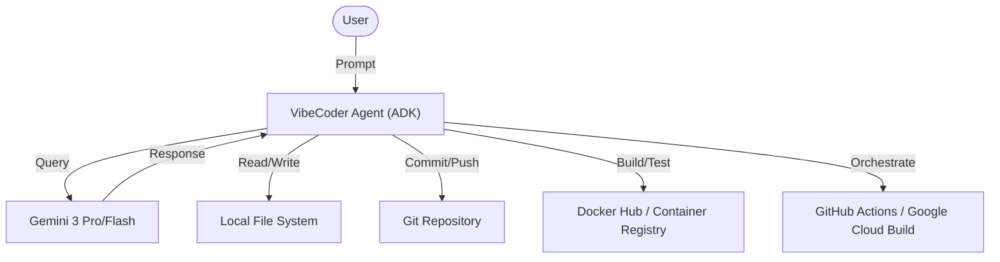

# Architecture Artifacts - VibeCoder

## Component Diagram

## Data Flow Diagram
1.  **User Input:** User provides a goal (e.g., "Implement feature X").
2.  **Planning Phase:** VibeCoder analyzes the goal and existing code, then generates an `implementation_plan.md`.
3.  **Refinement:** VibeCoder refines the plan based on user feedback or automated constraints.
4.  **Execution Phase:** VibeCoder calls specialized tools (File System, Terminal, Git) to create/modify code.
5.  **Verification Phase:** VibeCoder runs tests locally and via CI/CD pipelines.
6.  **Release Phase:** VibeCoder performs versioning (SEMVER) and publishes artifacts.

## Architecture Decision Records (ADRs)
See [adr/](file:///Users/abhishekaggarwal/Projects/Experiments/coding_buddy/docs/adr/) for detailed decisions.

- **ADR-001:** Use of Google ADK for agent orchestration.
- **ADR-002:** Implementation of Trunk-Based Development.
- **ADR-003:** Adoption of Semantic Versioning (SEMVER).
- **ADR-004:** Containerization using Docker for parity across environments.
